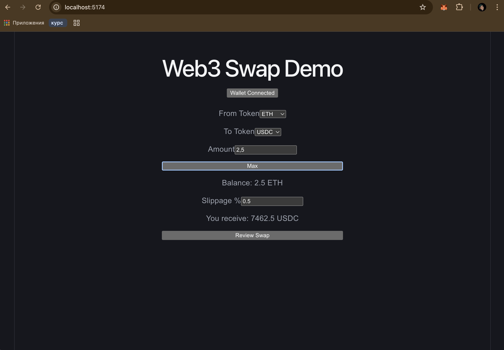
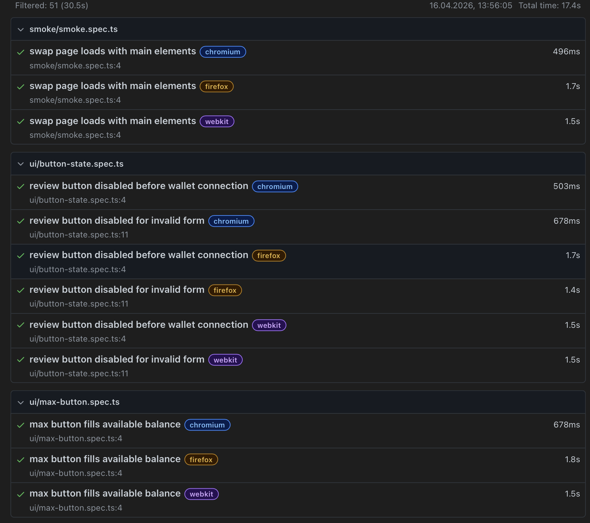

# 🧪 QA Web3 Swap Automation

QA automation project for a Web3 token swap interface, covering real-world scenarios such as validation, state management, and swap flow logic.
---

## 🚀 Project Overview

This project demonstrates automated testing of a token swap UI that simulates common Web3 interactions such as wallet connection, token selection, amount input, slippage configuration, and swap validation.

The goal is to show how a QA engineer approaches testing a real-world product: identifying key user flows, covering positive and negative scenarios, and organizing tests in a clear and maintainable way.

The project includes a demo swap interface built specifically for testing purposes.

---

## 🧠 QA Approach

- prioritize critical swap flow as primary business functionality
- cover positive and negative scenarios
- validate edge cases such as invalid slippage, zero amounts, and token conflicts
- ensure UI state consistency
- use Page Object Model for maintainability
  
Test scenarios were selected based on typical risks in swap interfaces:
- incorrect user input
- invalid token combinations
- UI state inconsistencies
- transaction pre-validation failures
---

## 🛠 Tech Stack

- Playwright
- TypeScript
- Node.js
- Page Object Model (POM)
- GitHub Actions (CI)

---

## 🔄 Continuous Integration

Tests are automatically executed using GitHub Actions.

CI workflow:
- install dependencies
- install Playwright browsers
- run Playwright tests in Chromium

Triggers:
- push to main
- pull requests

---

## 📂 Project Structure

qa-web3-swap-automation/
├── tests/
│   ├── smoke/
│   └── ui/
├── src/
│   └── pages/
├── playwright.config.ts
├── package.json
---

## ✅ Test Coverage

Test scenarios are prioritized based on impact on core swap functionality:
Smoke (P0):
- application loads correctly

Swap Flow (P0):
- user can complete valid swap flow

Validation (P1):
- empty amount (form validation)
- zero amount (invalid trade input)
- same token pair (logical conflict)
- invalid slippage (risk protection)
- insufficient balance (business constraint)

UI Behavior (P1):
- max button fills balance
- token selection updates state
- slippage change updates quote

Button State (P0):
- disabled before wallet connection
- disabled for invalid input

Quote (P1):
- visible for valid input

---

## ▶️ How to Run Tests

npm install  
npx playwright install  
npx playwright test  

---

## 📊 Test Reports

npx playwright show-report  

---

## 📸 Screenshots

### Application UI

### Test Run (CLI)

### Playwright Report

---

## ⚠️ Known Limitations

- uses mock wallet instead of real Web3 provider
- no real blockchain interaction

---

## 🚀 Future Improvements

- add API-level tests
- integrate real wallet (MetaMask)
- expand test coverage

---

## 🎯 Purpose

This project demonstrates:
- structured QA thinking
- UI automation skills
- ability to design test scenarios
- clean project organization
- CI integration
